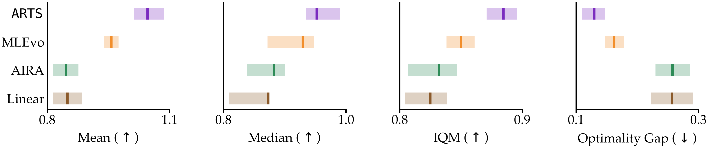
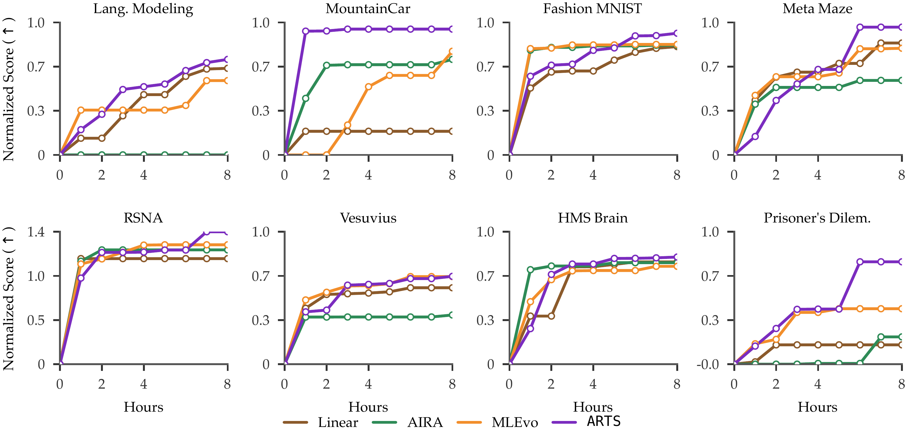

# ARTS — Agentic Reasoning for Tree Search

<p align="center">
  <a href="https://arxiv.org/abs/2606.21891"></a>
  <a href="https://automating-discovery.github.io/arts/"></a>
  <a href="https://github.com/UCSB-AI/arts"></a>
  <a href="https://x.com/GurushaJuneja/status/2069836256893345947?s=20"></a>
</p>


Automated scientific discovery is a **long-horizon search problem**: the decisions that
drive it — *what to try next*, and *when to persist versus when to pivot* — require
reasoning over a history that quickly outgrows the context window. In our paper,
[**"Learning the ARTS of Search for Automated Discovery"**](https://arxiv.org/abs/2606.21891),
we ask whether a Large Reasoning Model makes these decisions better than the heuristics
this search has long relied on — and introduce **ARTS** (Agentic Reasoning for Tree
Search): (i) **reasoning-guided exploration** and (ii) **test-time training** for long
search context.

Across MLGym and MLEBench, ARTS outperforms leading methods like **AIRA** and
**MLEvolve** by **15.3%**; with test-time training, a **Qwen3-4B** scientist matches an
**o3** scientist at **5× lower** inference cost.

<p align="center"></p>

ARTS reasons over the logs of prior experiments to propose high-quality hypotheses, and
uses **verbalized sampling** to keep them diverse. By inspecting the code, logs, and
training curves behind each result, it tells a *weak hypothesis* apart from a *weak
execution* — and acts on the difference, refining what works and abandoning what doesn't.

<p align="center"></p>

When the search history outgrows the context window, ARTS instills it into the
scientist's weights through **test-time training** — keeping the benefit of a long
search without paying for a long prompt.


## Results

Aggregate normalized scores across 19 MLGym + MLEBench tasks (95% bootstrap CIs).
ARTS leads on Mean, Median, and IQM, with the smallest optimality gap.

<p align="center">
  
</p>

Per-task normalized score vs. wall-clock time — ARTS often trails early, then
overtakes the baselines through more diverse hypothesis exploration.

<p align="center">
  
</p>

<sub>Full per-task numbers, formulas, and methodology:
[`ARTS_runs/RESULTS.md`](ARTS_runs/RESULTS.md).</sub>

## How it works

Each ARTS run pairs two models over an MLGym task:

- **Scientist** (a reasoning model, e.g. `o3`): inspects the experiment tree and
  prior logs, picks a parent node (deepen vs. explore), and issues a high-level
  *direction* — it does not write code.
- **Executor** (e.g. Gemini, or a local Qwen3-4B via vLLM): turns the direction
  into code, runs it in an MLGym container, and reports the score.

The score is fed back, the tree grows, and the scientist decides again. Test-time
training fine-tunes the scientist on these episodes with GRPO, via PRIME-RL.

## Repository layout

```
arts/
├── tree_search.py          # core infra: MLGym container manager, LLM client, task profiles
├── reflexion.py            # tree-level reflection / error analysis
├── search/
│   ├── arts.py             # ARTS — scientist-guided tree search (the method)
│   ├── linear.py           # Linear baseline (single long trajectory)
│   ├── aira/               # AIRA baseline (greedy / MCTS / evolutionary)
│   └── mlevolve/           # MLEvolve baseline (MCGS + cross-branch fusion)
├── ttt/
│   └── mlgym_env.py        # tree-structured TTT environment for PRIME-RL (GRPO)
└── visualization/                    # Streamlit tree viewer + trajectory viewer
configs/                    # PRIME-RL TTT configs (one per task, *_tree.toml)
mlgym_tree_env_v3/          # thin package exposing ttt/mlgym_env to PRIME-RL
scripts/
├── analysis/               # paper figure + table generators
├── template_*.sh           # parameterized launcher templates
└── prepare_mlebench_data.py
scripts/run_mlebench_*.sh           # SLURM launchers, one per method
```

## Install

ARTS depends on two sibling repos as editable installs:
[MLGym](https://github.com/facebookresearch/MLGym) (task environments) and
[prime-rl](https://github.com/PrimeIntellect-ai/prime-rl) (GRPO trainer).

```bash
git clone https://github.com/facebookresearch/MLGym.git
git clone https://github.com/PrimeIntellect-ai/prime-rl.git
git clone https://github.com/UCSB-AI/arts.git
cd arts

uv sync                                  # creates .venv and installs deps
docker pull aigym/mlgym-agent:latest     # MLGym execution sandbox
cp .env.example .env                     # add OPENAI_API_KEY / GEMINI_API_KEY / etc.
```

> **Requirements.** ARTS needs Linux, an NVIDIA GPU, Docker/Apptainer (MLGym runs
> candidate code in containers), and LLM API keys. `flash-attn` is a hard
> dependency (CUDA-only), so `uv sync` must run on a GPU machine.

## Running the search

Each method has a launcher that takes `TASK` and `EXECUTOR`. They are SLURM
templates — adapt the resource directives and the repo/data paths at the top of
each script to your cluster.

```bash
# ARTS (scientist=o3, executor=gemini-3-pro-preview)
sbatch --export=ALL,TASK=mlebenchAPTOS,EXECUTOR=gemini-3-pro-preview scripts/run_mlebench_llmg.sh

# Baselines
sbatch --export=ALL,TASK=mlebenchAPTOS,EXECUTOR=gemini-3-pro-preview scripts/run_mlebench_aira.sh
sbatch --export=ALL,TASK=mlebenchAPTOS,EXECUTOR=gemini-3-pro-preview scripts/run_mlebench_mlevolve.sh
sbatch --export=ALL,TASK=mlebenchAPTOS,EXECUTOR=gemini-3-pro-preview scripts/run_mlebench_linear.sh
```

To run a single method directly (no SLURM), call its module — e.g. ARTS:

```bash
uv run python arts/search/arts.py \
    --task-config tasks/titanic.yaml \
    --node-budget 100 --max-actions 200 \
    --scientist-model o3 --executor-model gemini-3-pro-preview \
    --output-dir outputs/arts_titanic
```

Ablations live in `scripts/run_mlebench_llmg_ablation.sh` and `scripts/run_mlebench_llmg_nosignal.sh`.

## Test-time training (TTT)

TTT is run with PRIME-RL against the tree-structured environment in
`arts/ttt/mlgym_env.py` (registered as env id `mlgym_tree_env_v3`). One config
per task lives in `configs/`:

```bash
uv run rl --config configs/prime_rl_v9.2_titanic_tree.toml
```

The reward is computed from the best score reached anywhere in the episode's tree;
the reward shaping is selectable via `reward_scheme` in the config (binary,
fixed-tier, or rolling-percentile). Rollout logs go to `$AIR_ROLLOUT_LOG_DIR`
(default `./rollout_logs`).

## Reproducing the paper figures

```bash
uv run python scripts/analysis/make_results_figures.py        # per-task grids
uv run python scripts/analysis/make_stats_from_curated.py     # IQM / P(improvement)
```

These read the curated runs under `ARTS_runs/` (the raw run
directories are not tracked in git; the per-cell summary `paper_runs_summary.csv`
and `RESULTS.md` are).

## Visualizing a search

```bash
uv run streamlit run arts/visualization/tree_viewer.py        # interactive experiment tree
uv run python arts/visualization/view_trajectory.py --latest  # terminal trajectory viewer
```

## Citation

```bibtex
@article{juneja2026arts,
  title   = {Learning the ARTS of Search for Automated Discovery},
  author  = {Juneja, Gurusha and Jain, Arnav Kumar and Nathani, Deepak and
             Wang, William Yang and Wang, Xin Eric},
  journal = {arXiv preprint arXiv:2606.21891},
  year    = {2026}
}
```

## License

See [LICENSE](LICENSE).
